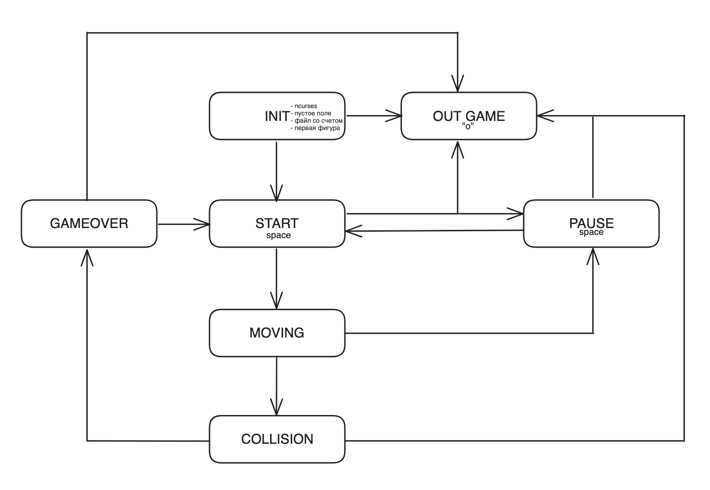

# Игра тетрис

## Управление

Игра Тетрис запускается в терминале и управляется с помощью следующих клавиш:  
w - повернуть фигуру  
a - переместить фигуру влево  
d - переместить фигуру вправо  
s - ускорить падение фигуры  
o - завершить игру  
space - пауза/продолжение игры  

### Начисление очков:

1 линия - 100 очков;  
2 линии - 300 очков;  
3 линии - 700 очков;  
4 линии - 1500 очков.  

### Механика уровней:
Каждый раз, когда игрок набирает 600 очков, уровень увеличивается на 1. Повышение уровня увеличивает скорость движения фигур. 
  
Максимальное количество уровней - 10.

#### FSM:
